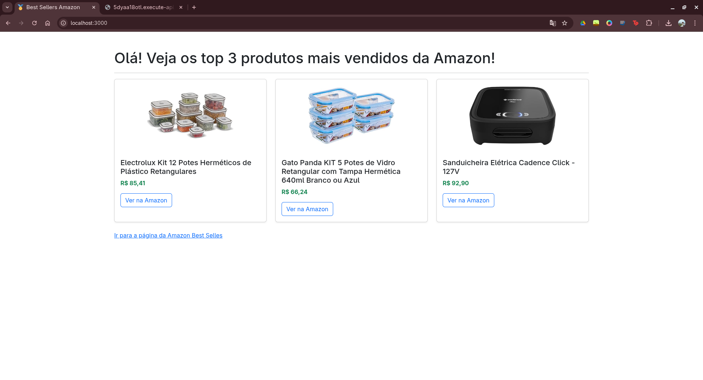

## Amazon Bestsellers Scraper & API
Este projeto consiste em um sistema automatizado que realiza o web scraping dos 3 primeiros produtos da página de ["Mais Vendidos"](https://www.amazon.com.br/bestsellers) da Amazon, armazena os dados em um banco NoSQL (DynamoDB) e os disponibiliza através de uma API REST hospedada na AWS.



### 🛠️ Tecnologias Utilizadas

* **Backend:** Node.js com TypeScript
* **Infrastructure as Code (IaC):** Serverless Framework (v3)
* **Cloud Provider:** AWS (Lambda, API Gateway, DynamoDB)
* **Web Scraping:** Puppeteer
* **Runtime Local:** Fedora Linux (Ambiente de desenvolvimento)

### 📋 Pré-requisitos
Antes de começar, você precisará ter instalado:

* [Node.js](https://nodejs.org/pt-br) (v18 ou superior)
* [AWS CLI](https://aws.amazon.com/pt/cli/) configurado com suas credenciais
* [Serverless Framework v3](https://www.serverless.com/framework/docs/getting-started)

### 🔧 Instalação e Configuração
Clone o repositório:

~~~bash
git clone https://github.com/anaclpsouza/BestSellers.git
cd BestSellers
~~~

Instale as dependências:

~~~bash
npm install
~~~

### 🚀 Passo a Passo de Execução

1. Deploy da Infraestrutura

O primeiro passo é subir a tabela do DynamoDB e as funções Lambda para a nuvem.

~~~bash
npx serverless@3 deploy
~~~

*Nota: Ao final do comando, você receberá a URL do endpoint da API. Guarde-a para o passo 3.*

2. Execução do Scraper (Local)
O scraper foi desenvolvido para rodar localmente, extrair os dados e popular o banco na nuvem.

~~~Bash
npx tsx scraper.ts
~~~
O script irá abrir um navegador em modo headless, capturar os 3 primeiros produtos e salvá-los no DynamoDB.

3. Consumo da API
Com o banco populado, você pode acessar os dados via GET na URL gerada no passo 1:

~~~Bash
curl --request GET 'https://SUA-URL.amazonaws.com/dev/products'
~~~ 

### 📑 Detalhes do Endpoint

**GET** `/products`

Retorna a lista dos 3 produtos mais vendidos capturados pelo scraper.

**Exemplo de Resposta (JSON):**
```json
{
  "items": [
    {
      "id": "B0CDJ4L7CZ",
      "title": "Sanduicheira Elétrica Cadence",
      "price": "R$ 97,76",
      "image": "https://m.media-amazon.com/...",
      "link": "https://www.amazon.com.br/..."
    }
  ]
}
```
Ou executando a URL diretamente no navegador para melhor visualização.

### 📂 Estrutura de Arquivos
- `src/scraper.ts`: Lógica do Web Scraping com Puppeteer.
- `src/functions/getProducts/`: Função Lambda que recupera dados do DynamoDB.
- `public/`: Interface web para visualização dos dados.
- `serverless.ts`: Configuração de Infraestrutura como Código (IaC).

### 🌐 Configuração do Frontend

Para visualizar os produtos renderizados no navegador através do arquivo `index.html`, é necessário configurar o endpoint da API:

1. Localize o arquivo `config.js` na pasta public.
2. Substitua o valor da propriedade `API_URL` pelo URL gerado após a execução do comando `npx serverless@3 deploy`.
3. Execute o comando `npm run frontend` e abra o link do servidor local.


